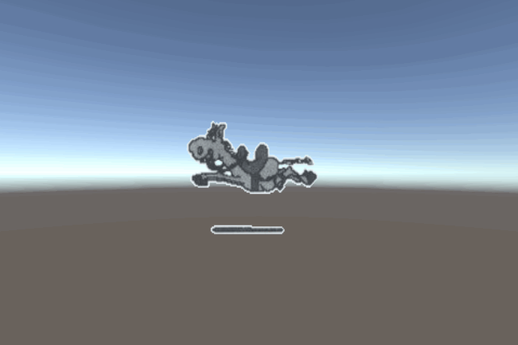
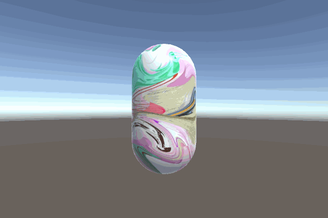
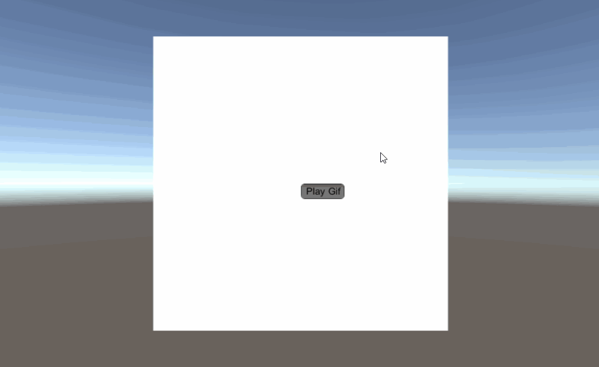

# MGS-2DAnimation
- [中文手册](./README_ZH.md)

## Summary
- Unity plugin for make 2D animation in scene.

## Environment
- Unity 5.0 or above.
- .Net Framework 3.5 or above.

## Demo
- Demos in the path "MGS-2DAnimation\Scenes" provide reference to you.

## Preview
- Renderer Frames

- UV Animation

- Gif Animation

## Contact
- If you have any questions, feel free to contact me at mogoson@outlook.com.