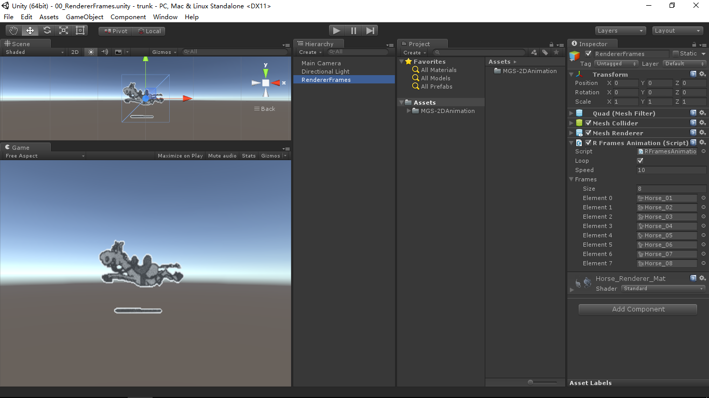

# MGS-2DAnimation
- [English Manual](./README.md)

## 概述
- Unity制作2D动画插件包。

## 环境
- Unity 5.0 或更高版本。
- .Net Framework 3.0 或更高版本。

## 实现
- RFramesAnimation：基于渲染器Renderer显示的序列帧（多个单帧图片）动画。
- SRFramesAnimation：基于精灵渲染器Sprite Renderer显示的序列帧（多个单帧图片）动画。
- UIFramesAnimation：基于UI组件Image显示的序列帧（多个单帧图片）动画。
- UVFramesAnimation：基于渲染器Renderer显示的序列帧（一个多帧图片）动画。
- UVAnimation：基于渲染器Renderer显示的UV映射偏移动画。

## 案例
- “MGS-2DAnimation\Scenes”目录下存有上述功能的演示案例，供读者参考。

## 图示
- RendererFrames

- UVAnimation

## 联系
- 如果你有任何问题或者建议，欢迎通过mogoson@qq.com联系我。